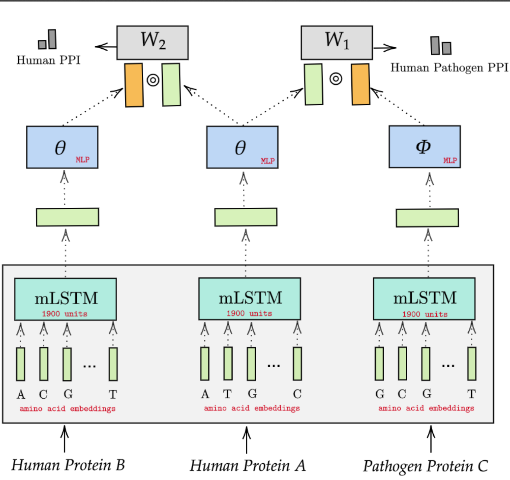
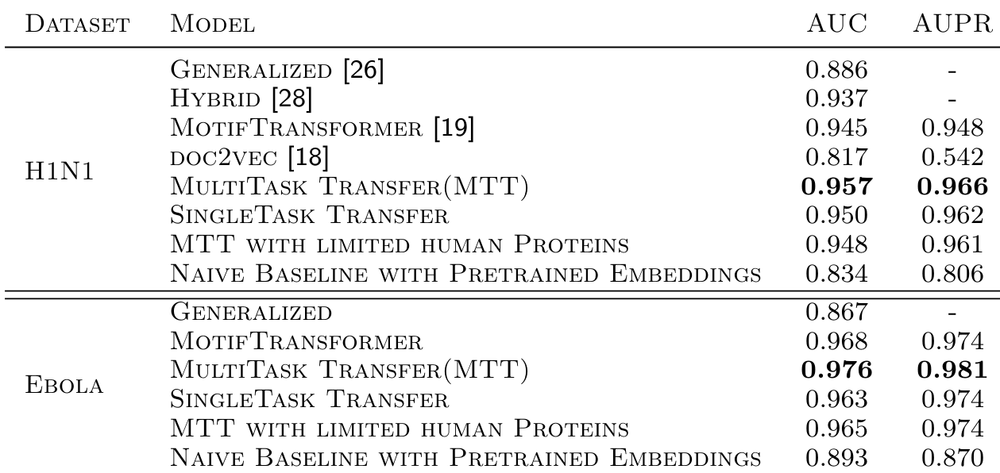
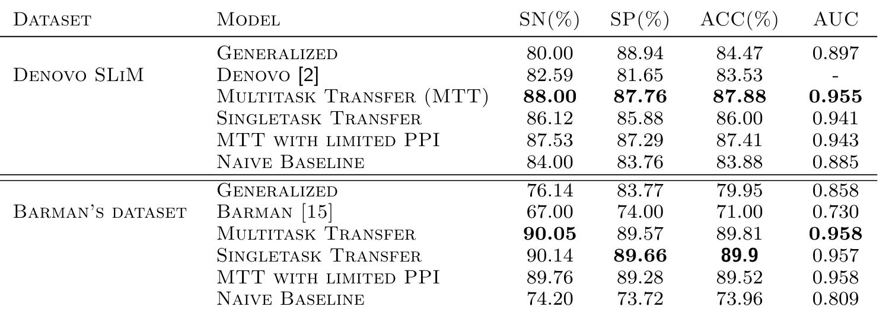
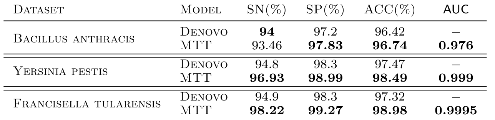
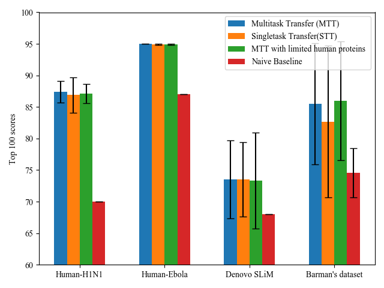

A multitask transfer learning framework for the novel viral-human PPI prediction

The code was tested on python 3.7+, all required packages are put in requirements.txt

1. To evaluate **MTT** model, run:

`python multitask.py --data_dir dataset/XXX`

where `XXX` is either [**human-H1N1**, **human-Ebola**, **Denovo_slim**, **Barman**, **Bacteria**]. However, for [**Barman**, **Bacteria**], paths to training and testing are needed to be changed also. Other configurable parameters include:
- _epochs_: The number of epochs to train. The default value is _40_ (which was used in our experiments)
- _n\_runs_: Number of experiment runs
- _ppi\_weight_: The weight of the human PPI prediction loss.

2. To evaluate **STT** model, run:

`python multitask.py --data_dir dataset/XXX --ppi_weight 0`

2. To evaluate **MTT with limited PPI** model, run:

`python multitask.py --data_dir dataset/XXX --human_feature_path hfeatures_sub.csv --hppi_edge_list hppi_edge_list_sub.csv --hppi_edge_weight hppi_edge_weight_sub.csv`

### Results
1. Results on the novel virus-human PPI prediction task.

2. Results on the virus-human PPI datasets with rich feature information.

3. Results on the novel bacteria-human PPI prediction task

3. Ablation Study

If you use the code in your work, please cite the following paper:
_Dong, Thi Ngan, and Megha Khosla. "A multitask transfer learning framework for the novel viral-human PPI prediction." bioRxiv (2021)._
